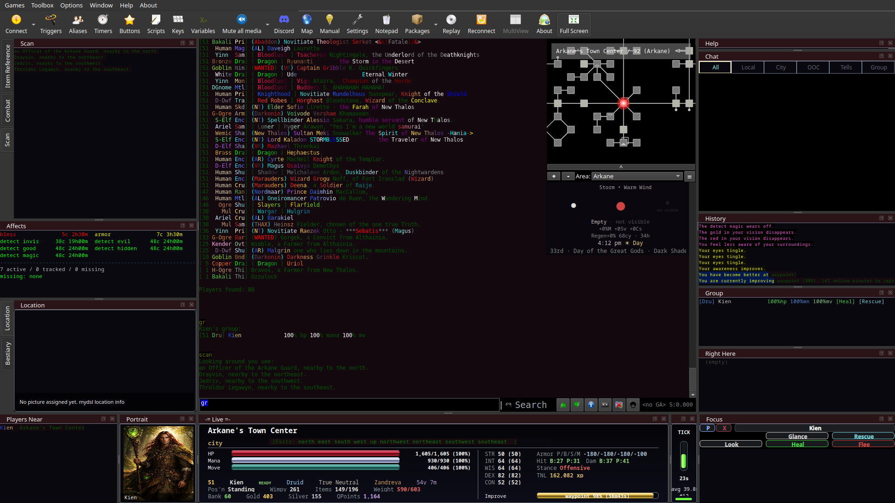

# MyDSL

**Bringing Algoron to life.**

[-informational?style=for-the-badge)](https://github.com/Siathes/MyDSL/releases/tag/mydsl-full-v1.0.0-testing)

A Mudlet addon suite for **Dark and Shattered Lands** (dsl-mud.org) that turns your console into a living view of the world — real weather and time of day coloring your background as it changes, all three of Algoron's moons tracked at once, and a full window layout for combat, group, target, mapping, and more laid over the game's own text without ever hiding or replacing a line of it.

- **Watch the world breathe.** An ambient background shifts with real weather and time of day, fading smoothly between them — your console looks like where you actually are, not a flat wall of text.
- **Track all three of Algoron's moons** — red, white, and black — phase, position, regen bonus, and a full countdown to your own moon's next phase, at a glance.
- **Always know what time it is in Algoron** — a live clock, day/night indicator, and date, without ever typing `time`.
- **Combat, group, and target windows** stay in sync with what's actually happening in the fight — no guessing, no polling.
- **A dozen built-in themes**, from a deep-gradient Tron blue to *Shattered Moonlight*, a signature theme built around Algoron's own three moons.
- **Every window is independently toggleable.** Build the layout you actually want, not the one that shipped.

## Get MyDSL

**[github.com/Siathes/MyDSL](https://github.com/Siathes/MyDSL)** — this repo. There are two ways to get it:

| | What it is | Where |
|---|---|---|
| **Clone the repo (recommended)** | The actual source, always current | `git clone https://github.com/Siathes/MyDSL.git` |
| **Download the prebuilt package** | `MyDSL_Full.mpackage`, ready to install in Mudlet | **[MyDSL Full v1.0.0 (Testing) →](https://github.com/Siathes/MyDSL/releases/tag/mydsl-full-v1.0.0-testing)** |

**This is an early testing build, not a finished 1.0.** It works and is actively played on, but hasn't yet been installed from scratch by anyone other than its own developer. Expect rough edges — [open an issue](https://github.com/Siathes/MyDSL/issues) if you hit one.

See [INSTALL.md](INSTALL.md) for full setup steps, including the optional sound/room-picture asset download.

## The DSL Mapper Addon (optional)

MyDSL Full above already includes mapping. If you only want the mapper on its own — no chat/combat/vitals windows, no dependency on the rest of MyDSL — it also ships separately as a lightweight **standalone package**, an add-on layer on top of Mudlet's own built-in mapper, not a replacement for it.

**[DSL Mapper Addon v0.2.11 →](https://github.com/Siathes/MyDSL/releases/tag/mapper-addon-v0.2.11)**

### What it adds
- Door-state tracking (open/closed/locked) read straight from DSL's own room text
- Terrain/sector room coloring, from GMCP room data
- Room movement-cost ("weight") learned from real observed move-point spend, not guessed
- GMCP-assisted room name/exit resolution
- Highlights other players' rooms on the map from the `where` command
- A **Safe Delete** option on the map's right-click menu

### Install
1. If you have an older copy installed, uninstall it first: **Toolbar → Packages → DSL Mapper Addon → Uninstall.** (Installing over an existing copy without uninstalling can nest content inside itself.)
2. Download `DSL_Mapper_Addon.mpackage` from the link above.
3. **Toolbar → Packages → Install Package** → select the file you downloaded.
4. If it tells you Mudlet's own Generic Mapper isn't loaded yet, open the Map widget once (`Ctrl+M` or the compass icon in the toolbar), then reinstall.

Full details and known issues are in the release's own notes.

## Requirements

- Mudlet 4.20 or newer (tested on 4.20.1 and 5.0.0)
- Mudlet's own built-in **Generic Mapper** already active in your profile — open the Map widget once if you've never used it in this profile before.
- A Dark and Shattered Lands character

## License

[PolyForm Noncommercial 1.0.0](LICENSE.md) — free to use, copy, modify, and redistribute (including modified/derivative versions) for any noncommercial purpose, which explicitly covers personal/hobby use. Commercial use isn't permitted.

## Source / issues

**[github.com/Siathes/MyDSL](https://github.com/Siathes/MyDSL)** — report bugs or ask questions via [Issues](https://github.com/Siathes/MyDSL/issues). Contributions/forks welcome.
